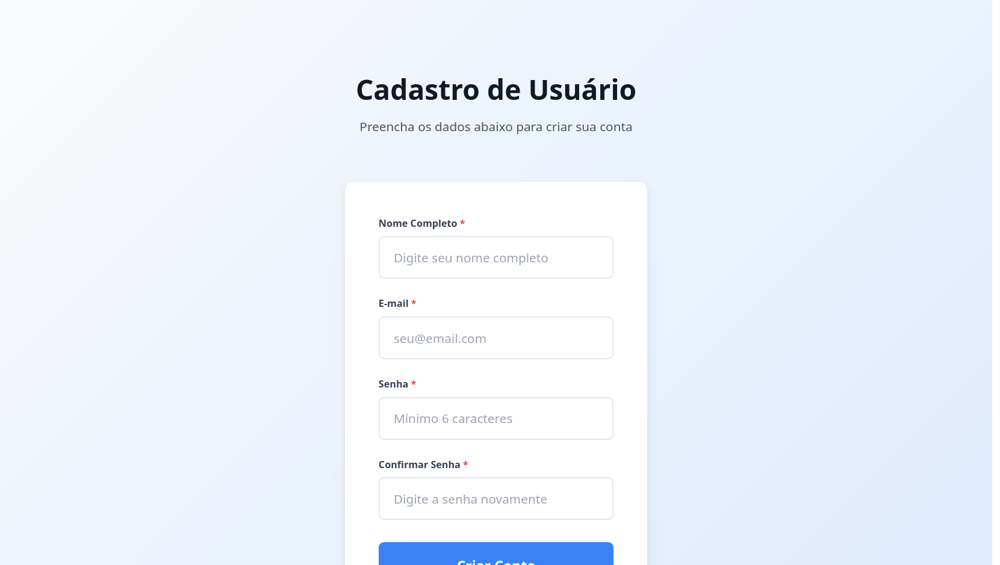
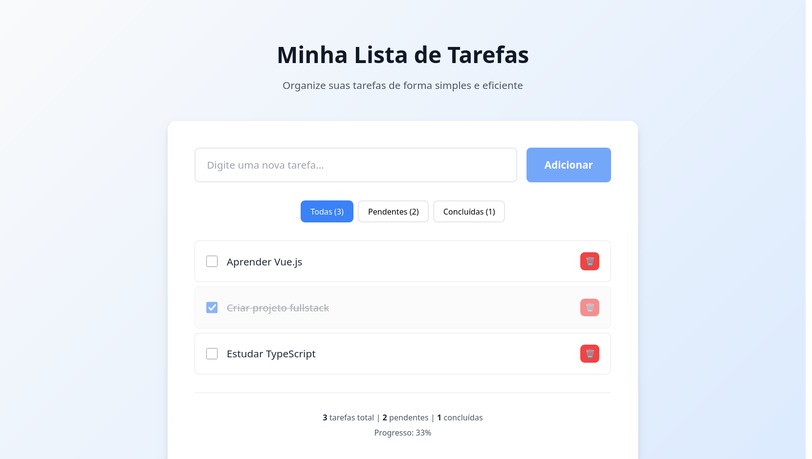

# Form + To-Do + API





Este projeto demonstra conhecimentos em **HTML, CSS, JavaScript/Vue.js, TypeScript, SQL e Node.js**.

## 📋 Estrutura do Projeto

```
form-todo-api/
├── frontend/
│   ├── index.html              # Formulário de cadastro (HTML + CSS)
│   ├── todo-list.html          # To-Do List (Vue.js com componentes inline)
│   ├── typescript-demo.html    # Demonstração TypeScript
│   ├── css/
│   │   └── global.css          # Estilos globais
│   └── src/
│       └── utils/
│           └── FilterUsers.ts  # Função TypeScript
├── backend/
│   ├── src/
│   │   ├── main.ts             # Servidor Node.js
│   │   ├── controllers/
│   │   │   └── UserController.ts
│   │   ├── services/
│   │   │   └── UserService.ts
│   │   └── routes/
│   │       └── userRoutes.ts
│   └── tsconfig.json
├── database/
│   └── query.sql              # Query SQL
└── README.md
```

## 🚀 Como Executar

1. **Instalar dependências:**
```bash
npm install
```

2. **Executar backend:**
```bash
npm run dev
```

3. **Acessar aplicações:**
- Formulário: `frontend/index.html`
- To-Do List: `frontend/todo-list.html`
- Demo TypeScript: `frontend/typescript-demo.html`
- API: `http://localhost:3000/users`

## 📝 Detalhamento dos Requisitos

### 1. HTML + CSS ✅

**Arquivo**: `frontend/index.html` e `frontend/css/global.css`

**Implementado:**
- ✅ Formulário com campos: Nome, E-mail, Senha
- ✅ Botão estilizado
- ✅ Validação básica (campos obrigatórios)
- ✅ Layout responsivo

**Como organizei o HTML e CSS:**

**Por que usei elementos HTML semânticos**

Usei elementos HTML que fazem sentido para o que estou criando. Em vez de usar `<div>` para tudo, uso `<form>` para agrupar os campos de cadastro, `<label>` para identificar cada campo, e `<input>` para os campos de entrada. Isso torna o código mais fácil de entender e ajuda pessoas com deficiência visual a navegar pela página.

**Por que separei o CSS em arquivo próprio**

Coloquei todos os estilos em um arquivo separado chamado `global.css` em vez de misturar com o HTML. Isso facilita muito a manutenção - se quero mudar a cor de todos os botões, só preciso alterar em um lugar. Também criei classes reutilizáveis como `.form-input` e `.btn-primary` que posso usar em qualquer página do projeto.

**Por que usei validação HTML5**

Usei a validação que já vem no HTML5 em vez de criar validação com JavaScript. Adicionei atributos como `required` (campo obrigatório), `type="email"` (só aceita email válido) e `minlength` (mínimo de caracteres). Isso é mais simples e funciona mesmo se o JavaScript estiver desabilitado no navegador.

### 2. JavaScript / Vue.js ✅

**Arquivo**: `frontend/todo-list.html`

**Implementado:**
- ✅ Adicionar novas tarefas
- ✅ Marcar tarefas como concluídas
- ✅ Remover tarefas da lista
- ✅ Filtros (Todas, Pendentes, Concluídas)

**Como organizei o Vue.js:**

**Por que usei componentes inline**

Quando comecei a fazer o to-do list, tentei primeiro criar componentes Vue.js em arquivos separados (`.vue`), que é a forma mais comum. Mas quando tentei abrir o HTML diretamente no navegador, deu erro porque o navegador não consegue carregar arquivos locais por questões de segurança (CORS).

Por isso, coloquei os componentes diretamente no HTML usando `defineComponent()`. Isso mantém a organização em componentes mas funciona sem precisar de ferramentas extras para compilar o código.

**Como dividi em componentes**

Dividi o to-do list em dois componentes para organizar melhor o código. O `TodoItem` cuida apenas de mostrar uma tarefa individual - tem o checkbox para marcar como concluída e o botão para remover. Ele recebe os dados da tarefa e avisa o componente pai quando algo muda.

O `TodoList` é o componente principal que gerencia tudo - a lista de tarefas, os filtros, adicionar novas tarefas e salvar no navegador. Ele usa o `TodoItem` para mostrar cada tarefa. Essa separação torna o código mais fácil de entender e manter.

**Como os componentes se comunicam**

Para os componentes se comunicarem, uso props (dados que vêm de cima) e emits (eventos que sobem). O `TodoList` passa os dados da tarefa para o `TodoItem` através de props. Quando o usuário marca uma tarefa como concluída, o `TodoItem` emite um evento que o `TodoList` escuta e atualiza a lista. Isso mantém o fluxo de dados organizado e previsível.

**Como funciona a reatividade**

Usei o sistema de reatividade do Vue.js para gerenciar os dados da aplicação. Quando adiciono uma tarefa ou marco como concluída, a interface atualiza automaticamente sem precisar manipular o HTML manualmente. Isso torna o código mais simples e garante que a tela sempre mostre os dados corretos.

**Como salvo as tarefas**

Para que as tarefas não sumam quando o usuário recarregar a página, uso o localStorage do navegador. É uma forma simples de salvar dados localmente sem precisar de banco de dados ou servidor. O código trata erros caso o localStorage não esteja disponível.

**Como melhorei a experiência do usuário**

Adicionei validações simples para melhorar a experiência do usuário. Não permite adicionar tarefas vazias ou duplicadas. Para remover tarefas, uso o SweetAlert2 que mostra uma confirmação bonita antes de excluir, evitando que o usuário remova algo por engano.

### 3. TypeScript ✅

**Arquivo**: `frontend/src/utils/FilterUsers.ts`

**Como organizei o TypeScript:**

**Por que criei uma interface**

Criei uma interface chamada `User` que define como deve ser um objeto usuário - tem que ter `id`, `name` e `age`. Isso ajuda o TypeScript a verificar se estou usando os dados corretos e evita erros como tentar acessar uma propriedade que não existe.

**Por que tipagem explícita**

A função `getUsersOver23` recebe uma lista de usuários e retorna apenas os nomes daqueles com mais de 23 anos. Escrevi explicitamente que ela recebe `User[]` e retorna `string[]`, assim fica claro o que a função faz e que tipo de dados ela espera.

**Por que usei filter() e map()**

Usei `filter()` para pegar apenas usuários com mais de 23 anos, e depois `map()` para extrair só os nomes. Essa forma é mais clara que usar loops e expressa exatamente o que quero fazer: primeiro filtrar, depois extrair os nomes.

**Implementação:**
```typescript
interface User {
    id: number;
    name: string;
    age: number;
}

function getUsersOver23(userList: User[]): string[] {
    return userList
        .filter(user => user.age > 23)
        .map(user => user.name);
}
```
- **Por que**: TypeScript garante que só recebemos objetos com `id`, `name` e `age`

### 4. Banco de Dados (SQL) ✅

**Arquivo**: `database/query.sql`

**Como organizei o SQL:**

**Por que uma query simples**

Escolhi uma query SQL simples que lista todos os usuários ordenados pelos mais recentes primeiro. É eficiente porque usa apenas uma tabela e uma ordenação básica. Em projetos reais, a coluna `created_at` teria um índice para tornar a busca mais rápida.

**Por que ORDER BY DESC**

Usei `ORDER BY created_at DESC` para mostrar os usuários mais recentes primeiro. Isso é o que as pessoas esperam - ver primeiro o que foi criado mais recentemente. É uma convenção comum em aplicações web.

**Implementação:**
```sql
SELECT id, name, email, created_at
FROM users
ORDER BY created_at DESC;
```

### 5. Backend (Node.js) ✅

**Arquivo**: `backend/src/main.ts`

**Como organizei o Backend:**

**Por que usei padrão MVC**

Usei o padrão MVC para organizar o código do backend de forma clara. O `UserController` cuida apenas de receber requisições HTTP e retornar respostas, enquanto o `UserService` contém a lógica de negócio. Essa separação facilita a manutenção e os testes.

**Por que criei um Service separado**

Criei um `UserService` que contém a lógica de negócio separada dos detalhes de HTTP. Isso permite reutilizar a mesma lógica em diferentes contextos e facilita a criação de testes, já que a lógica está isolada das dependências externas.

**Por que separei as rotas**

Separei as rotas em um arquivo dedicado (`userRoutes.ts`) para manter o arquivo principal limpo. Isso facilita adicionar novas rotas e mantém o código organizado conforme a aplicação cresce.

**Implementação:**
```typescript
app.get('/users', UserController.getUsers);
```
- **TypeScript**: Tipagem no backend

## 🏗 Organização de Projeto 

### Frontend (Vue.js)
```
frontend/
├── src/
│   ├── components/     # Componentes reutilizáveis
│   ├── views/          # Páginas
│   ├── services/       # Comunicação com API
│   ├── utils/          # Funções auxiliares
│   └── types/          # Tipos TypeScript
├── public/             # Arquivos estáticos
└── package.json
```

**Motivo**: Separação clara entre componentes, páginas e utilitários.

### Backend (Node.js)
```
backend/
├── src/
│   ├── controllers/    # Lógica de controle
│   ├── services/       # Lógica de negócio
│   ├── routes/         # Definição de rotas
│   ├── models/         # Modelos de dados
│   └── middleware/     # Middlewares
└── package.json
```

**Motivo**: Padrão MVC facilita manutenção e testes.

## Como Organizaria um Projeto do Zero

Quando começo um projeto novo, sempre penso primeiro em como organizar os arquivos para que seja fácil de entender e manter. A regra de ouro é: cada coisa no seu lugar, e cada lugar com uma função específica.

Para o frontend, separo os arquivos em pastas lógicas. Tenho uma pasta para componentes (botões, formulários, etc.), outra para páginas (home, login, etc.), e uma para funções auxiliares (como formatar datas ou validar emails). Isso evita que eu tenha que procurar arquivos perdidos e facilita quando preciso fazer mudanças.

No backend, uso uma estrutura simples mas eficiente. Separo as rotas (URLs da API) dos controllers (que processam as requisições) e dos services (que contêm a lógica de negócio). Por exemplo, se tenho uma API de usuários, crio um arquivo só para as rotas de usuário, outro só para a lógica de usuário, e assim por diante.

Para o banco de dados, sempre crio um arquivo de configuração separado e uso nomes claros para as tabelas e colunas. Em vez de chamar uma tabela de "usr", chamo de "users". Em vez de "dt_crt", uso "created_at". Isso torna tudo mais legível.

A documentação é importante desde o início. Sempre mantenho um README atualizado explicando como rodar o projeto e o que cada parte faz. Também comento o código quando faço algo que pode não ser óbvio para outra pessoa.

## Soluções para Problema de Lentidão no Login

Quando uma tela de login está lenta, o primeiro passo é descobrir onde está o problema. Uso as ferramentas de desenvolvedor do navegador (F12) para ver quanto tempo cada arquivo demora para carregar. Muitas vezes o problema está em imagens muito grandes ou arquivos JavaScript desnecessários sendo carregados na página de login.

No backend, verifico se as consultas ao banco de dados estão demorando muito. Às vezes o problema é simples: falta um índice na tabela de usuários para buscar por email ou nome de usuário. Sem índice, o banco precisa verificar todos os registros um por um, o que é muito lento.

Uma solução que sempre funciona é reduzir o que é carregado na tela de login. Em vez de carregar toda a aplicação de uma vez, carrego apenas o que é necessário para fazer login. Depois, quando o usuário já está logado, carrego o resto da aplicação. Isso torna a primeira tela muito mais rápida.